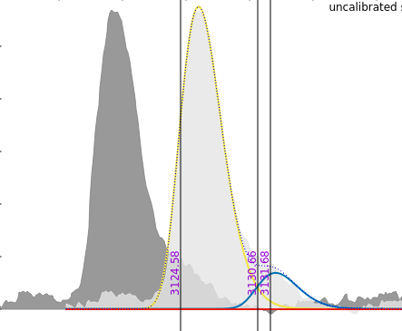
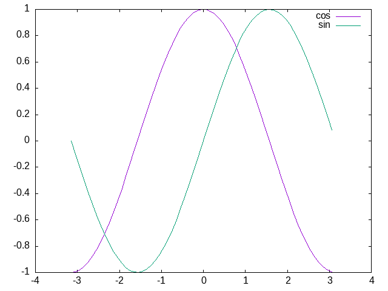

```@meta
CurrentModule = GnuPlotScripting
```

# Home

# Motivation

Despite the existence of other gnuplot wrappings in Julia:
- [Gnuplot.jl](https://github.com/gcalderone/Gnuplot.jl)
- [Gaston.jl](https://github.com/mbaz/Gaston.jl)

I developed this **extremely small** package for my own usage.

I needed a **simple** solution to:
- navigate/zoom across large 1D signals,
- create and write gnuplot scripts with embedded data.

Here is what I wrote, this is really rudimentary but it does what I
needed. By example I use it to plot nonlinear fittings in
spectrometry:




This package has no support for Pluto/Jupyter integration, and may
never have. Feel free to use it as it is...

# Getting started 

If you already know [gnuplot.info](http://www.gnuplot.info/), the good
news is that you only have few new stuff to learn: simply use
[`free_form()`](@ref free_form) to pass gnuplot commands.

Here are some basic functionalities with an example 

- to perform direct rendering of Gnuplot plots from Julia
- to create and save Gnuplot scripts with embedded data
- to easily export Gnuplot figures


```julia
using GnuPlotScripting

# create a gnuplot script
#
gp = GnuPlotScript()

# Fake data
#
X=[-pi:0.1:pi;];
Ys =sin.(X);
Yc =cos.(X);

# embed data into the script
#
id=register_data(gp,hcat(X,Ys,Yc))

# usual gnuplot command
#
free_form(gp,"replot '$id' u 1:3 w l t 'cos'")
free_form(gp,"replot '$id' u 1:2 w l t 'sin'")

# png export of the fig
#
export_png("fig.png",gp)

# write gnuplot script
#
write_script("gnuplot_script.gp",gp)
```

That's it! 

After running the previous code you will get a nearly immediate plot
of your figure, a `fig.png` image file



and a gnuplot script `gnuplot_script.gp` with embedded data you can
rerun when you want.

# Content

New things you have to know are summarized below.

```@contents
Pages = [
    "new_things_to_learn.md",
	"beside_free_form.md",
]
Depth = 3
```

The API is defined below:

```@contents
Pages = [
    "api.md",
]
Depth = 3
```

# Extra references

Some gnuplot extra references:

- [GnuPlot](http://www.gnuplot.info/) official page
- [GnuPlot in Action](https://www.manning.com/books/gnuplot-in-action-second-edition) a very well written book 
- [www.gnuplotting.org](http://www.gnuplotting.org/) a lot of great examples
- [GnuPlot not so Frequently Asked Questions](http://folk.uio.no/inf3330/scripting/doc/gnuplot/Kawano/index-e.html) 
- [Wikipedia](https://en.wikipedia.org/wiki/Gnuplot) free encyclopedia...


